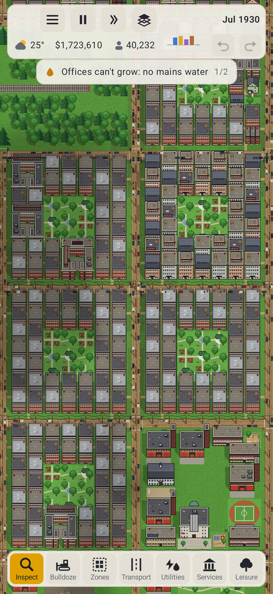
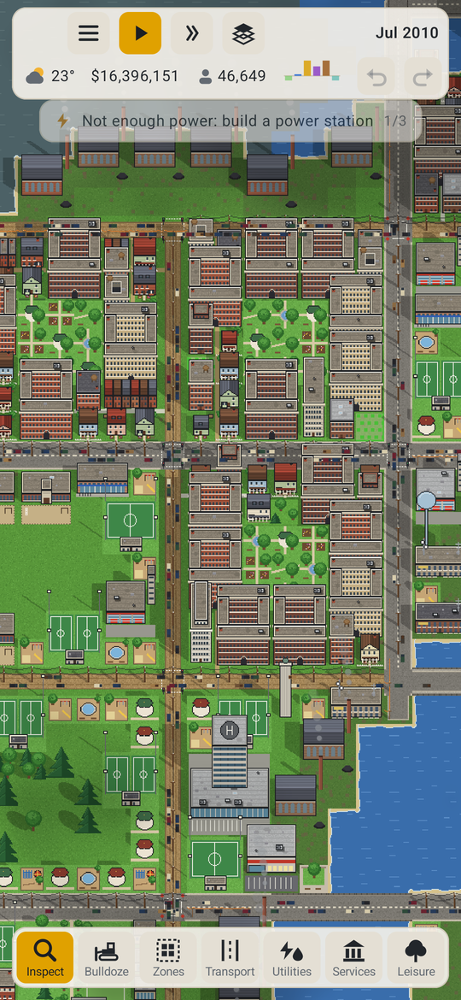
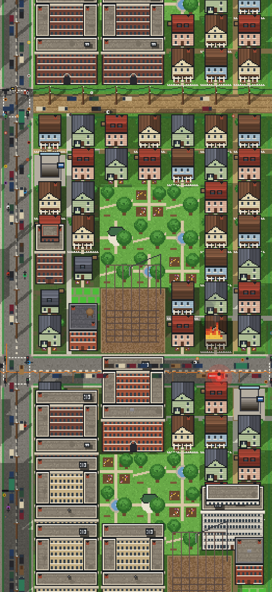
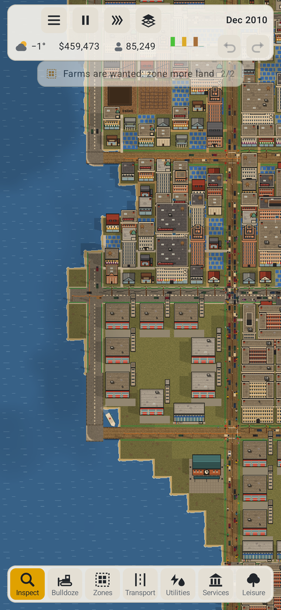
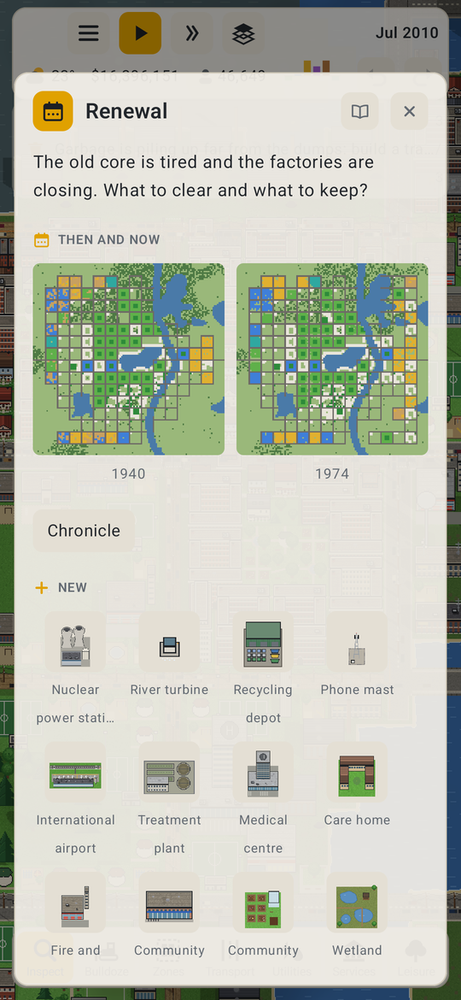
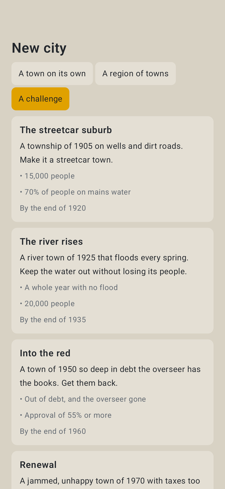

# Infill

Infill is a city builder for Android 8.1 and up.
It also runs in a web browser, and it's in English and French.

You start with a small town in 1900 and a few simple tools, and as the years go by the town and everything that keeps it running gets deeper. New things arrive in eras, and parts of your town get redone as they do: wells give way to water mains, streetcars to cars and back to transit, low houses to something denser.

It's at 0.14 and very playable, but not finished. Let me know what works and what doesn't in the #infill channel **[on my discord](https://discord.gg/9Wun47jGC6)**, or open an issue here.

Dan (rm)

---

## Screenshots

<table>
  <tr>
    <td align="center" width="33%"></td>
    <td align="center" width="33%"></td>
    <td align="center" width="33%"></td>
  </tr>
  <tr>
    <td align="center" width="33%"></td>
    <td align="center" width="33%"></td>
    <td align="center" width="33%"></td>
  </tr>
</table>

## What's in it

- Zones for homes, shops, offices, works and farms, from rural lots to towers, with lots that fill in over time
- Six eras from 1900 on, each with its own buildings, and older kinds of building that date until you bring them up to date
- Roads from dirt tracks to boulevards, junctions with stop signs, lights and roundabouts, and traffic you can watch and fix
- Rail, trams, buses, trolleybuses, a subway and ferries, with lines you plan stop by stop, park and ride, and cycling with cycle lanes
- Power stations from coal to small modular reactors, wind, sun and storage, each with newer kinds as the years go by
- Water mains, sewers and storm drains that age and need relaying
- Garbage from the town dump to recycling, compost and waste-to-energy
- Telephone exchanges, then fibre and masts
- Goods made from what's in the ground, sold in town or sent away
- Police, fire, schools, health and civic buildings, each with buildings that age and staff the town has to find
- Parks, sport and culture, which every home wants nearby, and fashions that come and go
- Crime of different kinds, with courts and jails to deal with it
- Ordinances, from the building code to prohibition and a carbon price, that history brings in and ends
- Money with teeth: bonds, a credit rating, and an overseer if the debt gets out of hand
- Public opinion: approval that weighs different things in each era, petitions, grants, protests and elections
- People who live through the century: a baby boom, smaller households, wealth that follows schooling, the poor priced out of dear land, and cholera, consumption and influenza until medicine comes
- Land that changes: mines and wells that run out, droughts, storm surges and high tides as the seas rise, woods that spread, and water you can fill in or dig out
- Districts with their own taxes and rules, and neighbouring towns to trade and commute with
- Weather, seasons, floods, fires and the odd disaster, or one you start yourself
- Fire engines, ambulances, police and garbage trucks out on the roads, and people walking and cycling along the streets
- A late game: working from home, offices and old works turned into homes, and legacy goals after the last era
- A guided first town, challenges, a sandbox, landmarks to earn, and achievements
- Towns you can share, open from a file, and take a picture of
- A chronicle of the town's story, in the papers of each era
- Map views for nearly all of it

## Manual

The whole manual is in the game, under Help, and the book button on most windows opens the part about that window. It's also here:

<!-- contents -->

1. [A first town](manual/01-a-first-town.md) - from an empty map to a town that grows by itself.
2. [The screen](manual/02-the-screen.md) - the strip, the tools, the map views, inspecting, undo, the keys, a controller and TalkBack.
3. [Zones and growth](manual/03-zones-and-growth.md) - what each zone grows, what a lot needs to grow, demand and land value.
4. [Roads and traffic](manual/04-roads-and-traffic.md) - roads, crossings, bridges and tunnels, and how the town drives on them.
5. [Transit and rail](manual/05-transit-and-rail.md) - cycling, trams, buses, trolleybuses, the subway, ferries, park and ride and trains.
6. [Ports, airports and trade](manual/06-ports-airports-and-trade.md) - ships, aircraft, goods and the outside market.
7. [Power](manual/07-power.md) - power stations, lines, losses, the peak, and the wind and sun.
8. [Water, drains and garbage](manual/08-water-and-waste.md) - wells and mains, pressure, sewers and foul water, storms and floods, and garbage.
9. [Phones and the internet](manual/09-phones.md) - exchanges, lines, masts and broadband.
10. [Services](manual/10-services.md) - police and justice, fire, health, schools, civic buildings and waste, and how their cover works.
11. [Leisure and parks](manual/11-leisure-and-parks.md) - what people want to do near home, and the parks, sport and culture that give it.
12. [People](manual/12-people.md) - households, ages, schooling, wealth, work, health and getting about.
13. [Money](manual/13-money.md) - taxes, income, upkeep, bonds, debt and the budget.
14. [Eras](manual/14-eras.md) - the six eras, what each needs and what each brings.
15. [Districts](manual/15-districts.md) - painting districts, their taxes, height limits and policies.
16. [Ordinances](manual/16-ordinances.md) - town-wide laws: what each does, what it costs, and the years history gives it.
17. [The environment](manual/17-the-environment.md) - pollution, grime, smog, noise, heat and carbon.
18. [Weather and disasters](manual/18-weather-and-disasters.md) - climates, seasons, rain and snow, and what can go wrong.
19. [Regions](manual/19-regions.md) - towns side by side, and what crosses between them.
20. [The town's story](manual/20-the-towns-story.md) - the chronicle, the graphs, then and now, and why lots aren't growing.
21. [Public opinion](manual/21-public-opinion.md) - approval, what people mind, petitions, grants, protests and elections.
22. [Settings and sound](manual/22-settings-and-sound.md) - the settings, and what you hear.

<!-- /contents -->

## Building

You need the Android SDK.

```sh
./gradlew :app:assembleDebug                   # debug APK
./gradlew :sim:jvmTest                         # the simulation's tests
./gradlew :shared:wasmJsBrowserDistribution    # the browser version
tools/serve_web.sh                             # serve it on port 8790
cd tools && uv run --with pillow gen_tiles.py  # draw the tiles again
cd tools && uv run --with pillow make_icon.py  # make the icons from icon.png
tools/style_check.py --all                     # check the writing
git config core.hooksPath tools/hooks          # and check it on every commit
```

| | |
|---|---|
| Minimum Android | 8.1 (API 27) |
| Built against | API 37 |
| UI | Kotlin, Compose Multiplatform |

## Licence

Infill is free software under the GNU General Public License, version 3 or later. See [LICENSE](LICENSE).

Copyright © 2026 Dan Hunke.

Made with Claude Opus 5.5.
