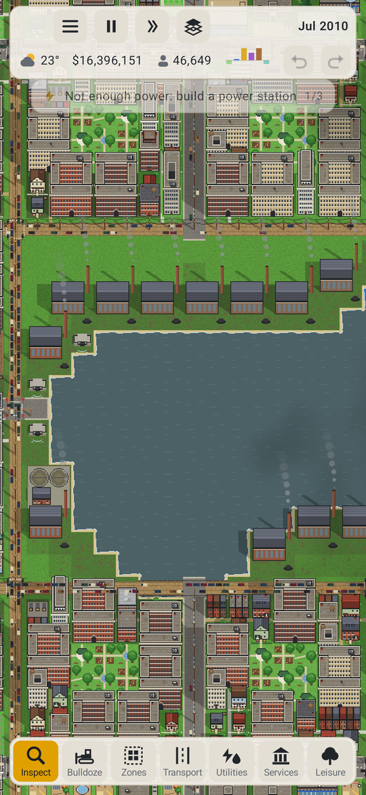
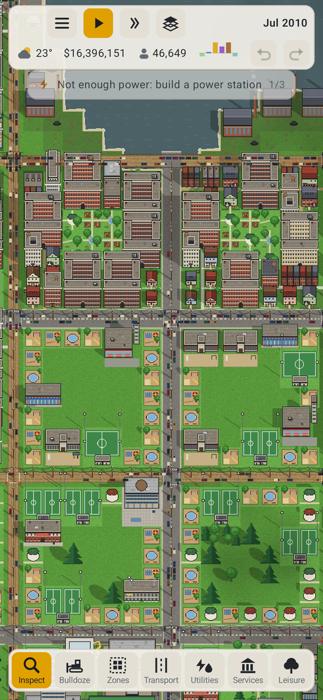
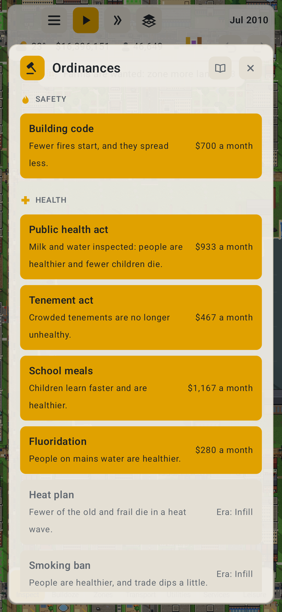

# Infill

Infill is a city builder for Android 8.1 and up.
It also runs in a web browser.

You start with a small town in 1900 and a few simple tools, and as the years go by the town and everything that keeps it running gets deeper. New things arrive in eras, and parts of your town get redone as they do: wells give way to water mains, streetcars to cars and back to transit, low houses to something denser.

It's at 0.11 and very playable, but not finished. Let me know what works and what doesn't, or open an issue here.

Made with Claude Opus 5.5.

Dan (rm)

---

## Screenshots

<table>
  <tr>
    <td align="center" width="33%"></td>
    <td align="center" width="33%"></td>
    <td align="center" width="33%"></td>
  </tr>
  <tr>
    <td align="center" width="33%"></td>
    <td align="center" width="33%"></td>
    <td align="center" width="33%"></td>
  </tr>
</table>

## What's in it

- Zones for homes, shops, offices, works and farms, from rural lots to towers, with lots that fill in over time
- Five eras from 1900 on, each with its own buildings, and older kinds of building that date until you bring them up to date
- Roads from dirt tracks to boulevards, junctions with stop signs, lights and roundabouts, and traffic you can watch and fix
- Rail, trams, buses, trolleybuses and a subway, with lines you plan stop by stop
- Power stations from coal to small modular reactors, wind, sun and storage, each with newer kinds as the years go by
- Water mains, sewers and storm drains that age and need relaying
- Garbage from the town dump to recycling, compost and waste-to-energy
- Telephone exchanges, then fibre and masts
- Goods made from what's in the ground, sold in town or sent away
- Police, fire, schools, health and civic buildings, each with buildings that age and staff the town has to find
- Parks, sport and culture, which every home wants nearby, and fashions that come and go
- Crime of different kinds, with courts and jails to deal with it
- Ordinances, from the building code to prohibition and a carbon price, that history brings in and ends
- Money with teeth: bonds, a credit rating, and an overseer if the debt gets out of hand
- Public opinion: approval that weighs different things in each era, petitions, grants, protests and elections
- People who live through the century: a baby boom, smaller households, wealth that follows schooling, the poor priced out of dear land, and cholera, consumption and influenza until medicine comes
- Land that changes: mines and wells that run out, droughts, storm surges as the seas rise, and woods that spread
- Districts with their own taxes and rules, and neighbouring towns to trade and commute with
- Weather, seasons, floods, fires and the odd disaster
- A chronicle of the town's story, in the papers of each era
- Map views for nearly all of it

## Building

You need the Android SDK.

```sh
./gradlew :app:assembleDebug                   # debug APK
./gradlew :sim:jvmTest                         # the simulation's tests
./gradlew :shared:wasmJsBrowserDistribution    # the browser version
tools/serve_web.sh                             # serve it on port 8790
cd tools && uv run --with pillow gen_tiles.py  # draw the tiles again
cd tools && uv run --with pillow make_icon.py  # make the icons from icon.png
tools/style_check.py --all                     # check the writing
git config core.hooksPath tools/hooks          # and check it on every commit
```

| | |
|---|---|
| Minimum Android | 8.1 (API 27) |
| Built against | API 37 |
| UI | Kotlin, Compose Multiplatform |

## Licence

Infill is free software under the GNU General Public License, version 3 or later. See [LICENSE](LICENSE).

Copyright © 2026 Dan Hunke.
