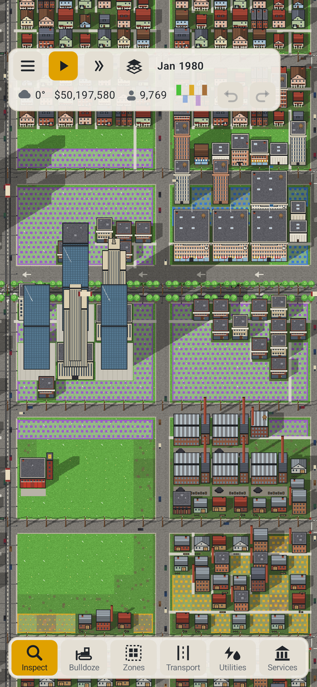
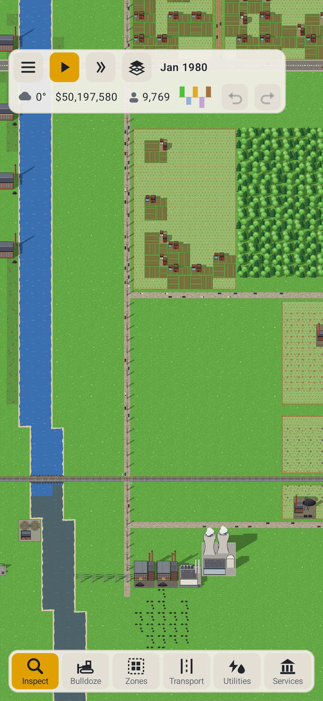
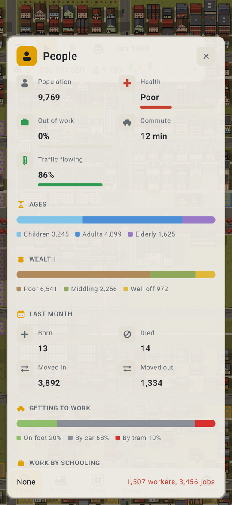
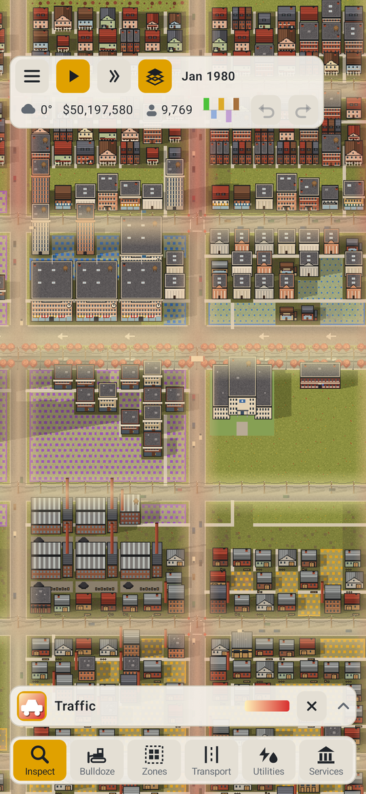
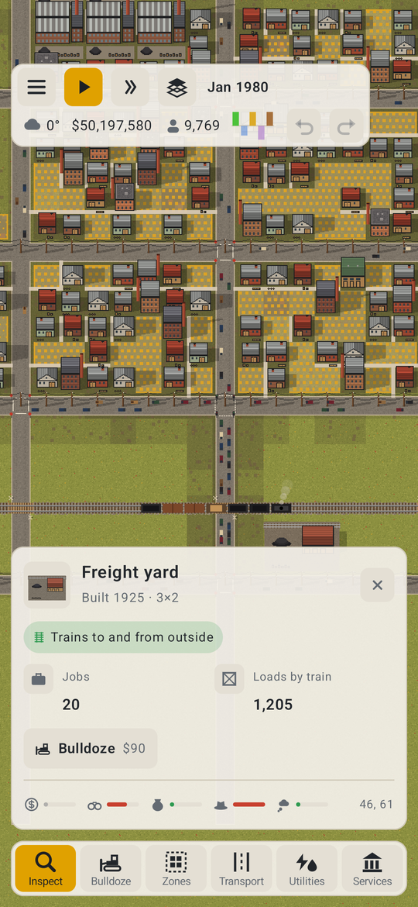
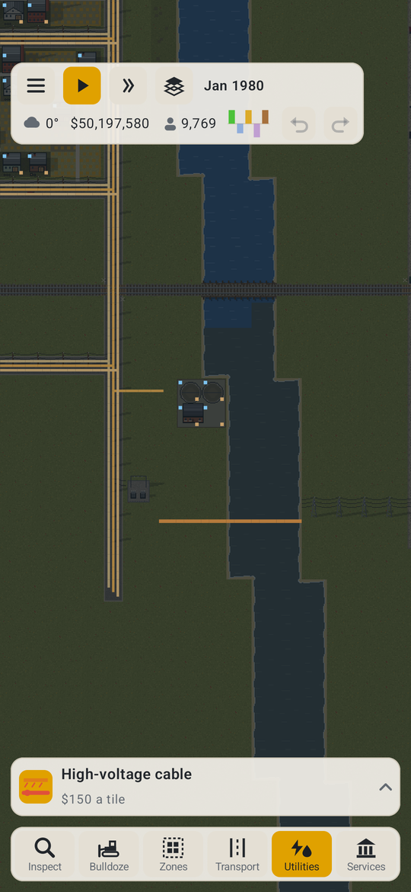

# Infill

Infill is a city builder for Android 8.1 and up.
It also runs in a web browser.

You start with a small town in 1900 and a few simple tools, and as the years go by the town and everything that keeps it running gets deeper. New things arrive in eras, and parts of your town get redone as they do: wells give way to water mains, streetcars to cars and back to transit, low houses to something denser.

It's at 0.8.5 and very playable, but not finished. Let me know what works and what doesn't, or open an issue here.

Made with Claude Opus 5.5.

Dan (rm)

---

## Screenshots

<table>
  <tr>
    <td align="center" width="33%"><br>Downtown</td>
    <td align="center" width="33%"><br>The country</td>
    <td align="center" width="33%"><br>The people</td>
  </tr>
  <tr>
    <td align="center" width="33%"><br>Traffic</td>
    <td align="center" width="33%"><br>Freight by rail</td>
    <td align="center" width="33%"><br>Underground</td>
  </tr>
</table>

## What's in it

- Zones for homes, shops, offices, works and farms, at three densities, with lots that fill in over time
- Roads from dirt tracks to boulevards, junctions with stop signs, lights and roundabouts, and traffic you can watch and fix
- Rail, trams, buses, trolleybuses and a subway, with lines you plan stop by stop
- Power from coal to nuclear, lines on poles or underground, and the load on each
- Water mains, sewers and storm drains that age and need relaying
- Telephone exchanges, then fibre and masts
- Goods made from what's in the ground, sold in town or sent away
- Police, fire, schools, health, parks and waste, each with buildings that age and staff the town has to find
- Crime of different kinds, with courts and jails to deal with it
- Districts with their own taxes and rules
- Weather, seasons, floods, fires and the odd disaster
- Map views for nearly all of it

## Building

You need the Android SDK.

```sh
./gradlew :app:assembleDebug                   # debug APK
./gradlew :sim:jvmTest                         # the simulation's tests
./gradlew :shared:wasmJsBrowserDistribution    # the browser version
tools/serve_web.sh                             # serve it on port 8790
cd tools && uv run --with pillow gen_tiles.py  # draw the tiles again
cd tools && uv run --with pillow make_icon.py  # make the icons from icon.png
```

| | |
|---|---|
| Minimum Android | 8.1 (API 27) |
| Built against | API 37 |
| UI | Kotlin, Compose Multiplatform |

## Licence

Infill is free software under the GNU General Public License, version 3 or later. See [LICENSE](LICENSE).

Copyright © 2026 Dan Hunke.
